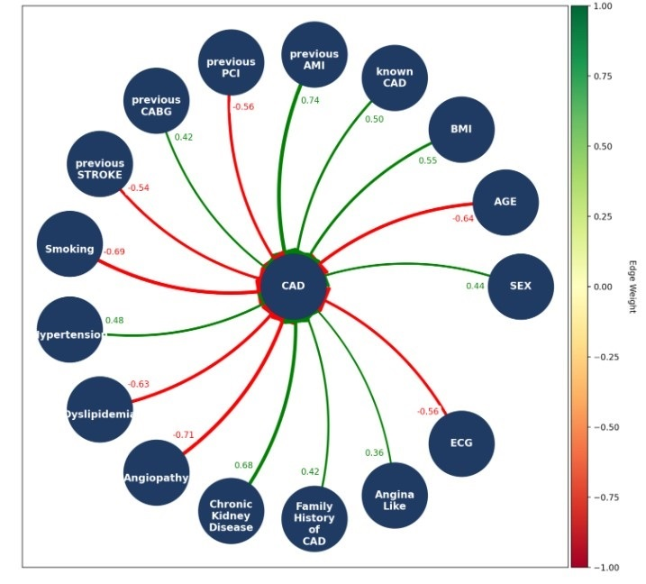

# FCM-GA

# Usage

FCM-ELM provides a transparent view of interconnections and their contributions to FCM's predictive accuracy.

To use FCM-ELM, utilize the following code block:

```
best_fcm_weights = FCM_ELM(initial_weight_matrix, num_iterations, training_dataset, learning_rate)
```

# Training

The training process of FCM-ELM is demonstrated.

```
def FCM_ELM(initial_weights, num_iterations, input_features, learning_rate=0.1, lambda_reg=0.01):
    best_weights = initial_weights.copy()
    best_mse = float('inf')
    num_dimensions = initial_weights.shape[0]
    num_hidden_units = 30  # Number of hidden units in ELM, you can adjust this as needed

    training_real_output = input_features[:, -1]  # Assuming the last column is the output

    lower_bounds = initial_weights - 0.1
    upper_bounds = initial_weights + 0.1

    for iteration in range(num_iterations):
        fcm_weights = update_fcm_weights(best_weights, input_features)
        fcm_weights = constrain_weights(fcm_weights, initial_weights, lower_bounds, upper_bounds)
        input_weights = np.random.uniform(size=(num_hidden_units, num_dimensions - 1), low=-1, high=1)
        hidden_layer_output = np.dot(input_features[:, :-1], input_weights.T)  # Exclude the last column for input features
      
        # Add bias term to hidden layer output
        hidden_layer_output_with_bias = np.hstack((hidden_layer_output, np.ones((hidden_layer_output.shape[0], 1))))
      
        # Compute output weights using Moore-Penrose pseudoinverse
        output_weights = np.linalg.pinv(hidden_layer_output_with_bias).dot(training_real_output)
      
        elm_output, _ = elm_predict(input_features[:, :-1], input_weights, output_weights)  # Exclude the last column for input features
        current_mse = mse_loss_with_regularization(training_real_output, elm_output, fcm_weights, initial_weights, lambda_reg)

        if current_mse < best_mse:
            best_mse = current_mse
            best_weights = fcm_weights
      
        if current_mse < 0.8:
            break
      
        best_weights = fcm_weights + learning_rate * ((training_real_output - elm_output) * elm_output * (1 - elm_output)).T @ input_features[:, :-1]

    return best_weights
```

# Interpretation

This block of code will demonstrate the interconnections among concepts

```
plot_FCM_weight_matrix_graph(column_names, last_column_except_last)
```



## Dataset Description:

•	dataset.xlsx: It includes the clinical data in an array format with rows the number of instances and columns. For every instance, the id is provided.
•	suggested_weights: This Excel file is optional for FCM-ELM. It includes the linguistic values for the input-output interconnections among FCM concepts provided by experts.

## Prerequisites:

-numpy
-time
-random
-pandas
-scikit-learn
-math
-statistics
-matplotlib
-networkx

## Contributors

[Anna Feleki](https://emerald.uth.gr/personnel/)
[Elpiniki Papageorgiou](https://emerald.uth.gr/personnel/)
[Ioannis Apostolopoulos](https://emerald.uth.gr/personnel/)
[Nikolaos Papandrianos](https://emerald.uth.gr/personnel/)
[Serafeim Moustakidis](https://emerald.uth.gr/personnel/)

## Assets

In the /assets folder, you'll find an example file for suggested_weights, and a visual representation of the interconnections among concepts in a FCM graph.
For suggested weights file, the following linguistic values must be provided, each representing a specific range:

For positive influence among concepts:
Very Weak (VW): [0,0.25]
Weak (W): [0.1,0.4]
Medium (M): [0.35,0.65]
Strong (S): [0.55,0.85]
Very Strong (VS): [0.75,1]

For negative influence among concepts:
-Very Weak (-VW): [-0.25,0]
-Weak (-W): [-0.4,-0.1]
-Medium (-M): [-0.65,-0.35]
-Strong (-S): [-0.85,-0.55]
-Very Strong (-VS): [-1,0.75]

Otherwise please provide the value :
random: [-1,1]
