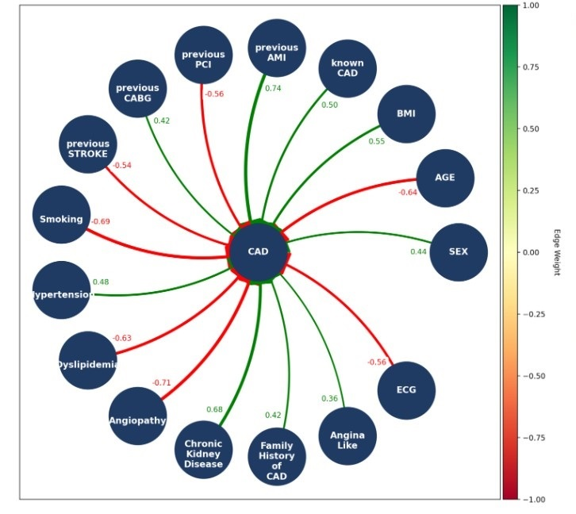

# FCM-PSO

This is the official implementation of

[https://doi.org/10.1007/978-3-031-39965-7_2](https://doi.org/10.1007/978-3-031-39965-7_2),

# Paper Abstract

 [https://doi.org/10.1007/978-3-031-39965-7_2](https://doi.org/10.1007/978-3-031-39965-7_2),
Coronary artery disease (CAD) is the primary cause of death and chronic disability among cardiovascular conditions worldwide. Its diagnosis is challenging and cost-effective. In this research work, Fuzzy Cognitive Maps with Particle Swarm Optimization (FCM-PSO) were used for CAD classification (healthy and diseased). In particular, a new DeepFCM framework, which integrates image and clinical data of the patients is proposed. In this context, we employed the FCM-PSO method enhanced by experts’ knowledge, along with an efficient attention Convolutional Neural Network, to improve diagnosis. The proposed method is evaluated using 571 participants and achieved 77.95 ± 5.58% accuracy, 0.22 ± 0.05 loss, 76.98 ± 8.27% sensitivity, 77.39 ± 7.13% specificity, and 73.97 ± 0.09% precision, implementing a 10-fold cross-validation process. The results extracted from the proposed model demonstrate the model’s efficiency and outperform traditional machine learning algorithms. An essential asset of the proposed DeepFCM framework is the explainability, as it offers nuclear physicians’ meaningful causal relationships between clinical factors regarding the diagnosis.
Keywords:  Fuzzy Cognitive Maps · Particle Swarm Optimization ·
 Classification · Coronary artery disease

# Usage

This approach enhances interpretability by providing a transparent view of interconnections and their contributions to FCM's predictive accuracy.

The dataset should be initialized here:
```
dataset=pd.read_excel("dataset.xlsx", engine='openpyxl')
```

If suggested weights are provided for the initialization of interconnections among concepts, the 'suggested_weights' variable should be initialized as below
An example of an excel with initialized interconnections is provided in /assets folder
```
# suggested_weights = pd.read_excel("suggested_weights.xlsx", engine='openpyxl')
```


or else, the 'suggested_weights' variable should be equal to 'None' as it is.
```
suggested_weights=None
```
To modify the number of particles and training epochs, adjust the following parameters accordingly
```
num_particles = 40

#Define number of epochs
epoch=30
```
To alter the number of folds for k-fold cross validation, adjust the following parameter
```
#perform k-fold cross validation 
#Define K (num_folds) for k-fold cross validation
num_folds=10
```
To use the FCM-PSO function, utilize the following code block:

```
best_position, concept_evolution = FCM_PSO(training_dataset,  num_dimensions=num_dimensions, num_particles=num_particles, maxiter=epoch, suggested_weights=suggested_weights)

```

# Training

The training process of FCM-PSO is demonstrated.

```
def FCM_PSO(dataset, num_dimensions, num_particles, maxiter, suggested_weights=None):
    err_best_g = float('inf')
    pos_best_g = []
    swarm = [Particle(suggested_weights=suggested_weights) for _ in range(num_particles)]
    concept_evolution = np.zeros((maxiter, num_dimensions))  # Record concept values over epochs

    for k in range(maxiter):
        # Evaluate fitness of each particle at its current position
        for particle in swarm:
            fitness_result = 0
            for row in dataset:
                fcm_output = [0] * num_dimensions
                for i in range(num_dimensions):
                    sum_temp = sum(particle.position_i[j][i] * row[j] for j in range(num_dimensions) if i != j)
                    fcm_output[i] = sig(sum_temp)

                fitness_result += np.square(fcm_output[-1] - row[-1])

            particle.err_i = fitness_result / len(dataset)
            particle.evaluate(particle.err_i)

            # Update the global best position
            if particle.err_i < err_best_g or k == 0:
                pos_best_g = particle.position_i.copy()
                err_best_g = particle.err_i

        # Record the concept evolution
        concept_evolution[k, :] = [sig(sum(pos_best_g[j][i] * value for j, value in enumerate(row))) for i in range(num_dimensions)]

        # Update velocity and position of each particle after fitness evaluation
        for particle in swarm:
            particle.update_velocity(pos_best_g, num_dimensions)
            particle.update_position(num_dimensions)

    return pos_best_g, concept_evolution
```

# Interpretation

This block of code demonstrates the interconnections among concepts

```
plot_FCM_weight_matrix_graph(column_names, last_column_except_last)
```



## Dataset Description:

•	dataset.xlsx: It includes the clinical data in an array format with rows the number of instances and columns. For every instance, the id is provided.
•	suggested_weights: This Excel file is optional for FCM-PSO. It includes the linguistic values for the input-output interconnections among FCM concepts provided by experts.

Algorithm file: main.py is the FCM algorithm tha integrates PSO into FCM learning processes.

## Prerequisites:

-numpy
-time
-random
-pandas
-scikit-learn
-math
-statistics
-matplotlib
-networkx

## Contributors

[Anna Feleki](https://emerald.uth.gr/personnel/)
[Elpiniki Papageorgiou](https://emerald.uth.gr/personnel/)
[Ioannis Apostolopoulos](https://emerald.uth.gr/personnel/)
[Nikolaos Papandrianos](https://emerald.uth.gr/personnel/)
[Serafeim Moustakidis](https://emerald.uth.gr/personnel/)

## Citation

If you find this work useful, please cite our paper:

Anna Feleki, Ioannis Apostolopoulos, Konstantinos Papageorgiou, Elpiniki Papageorgiou, Dimitrios Apostolopoulos, Nikolaos Papandrianos, N.I. (2023). A Fuzzy Cognitive Map Learning Approach for Coronary Artery Disease Diagnosis in Nuclear Medicine. In: Massanet, S., Montes, S., Ruiz-Aguilera, D., González-Hidalgo, M. (eds) Fuzzy Logic and Technology, and Aggregation Operators. EUSFLAT AGOP 2023 2023. https://doi.org/10.1007/978-3-031-39965-7_2

## Assets

In the /assets folder, you'll find an example file for suggested_weights, and a visual representation of the interconnections among concepts in a FCM graph.
For suggested weights file, the following linguistic values must be provided, each representing a specific range:

For positive influence among concepts:
Very Weak (VW): [0,0.25]
Weak (W): [0.1,0.4]
Medium (M): [0.35,0.65]
Strong (S): [0.55,0.85]
Very Strong (VS): [0.75,1]

For negative influence among concepts:
-Very Weak (-VW): [-0.25,0]
-Weak (-W): [-0.4,-0.1]
-Medium (-M): [-0.65,-0.35]
-Strong (-S): [-0.85,-0.55]
-Very Strong (-VS): [-1,0.75]

Otherwise please provide the value :
random: [-1,1]
