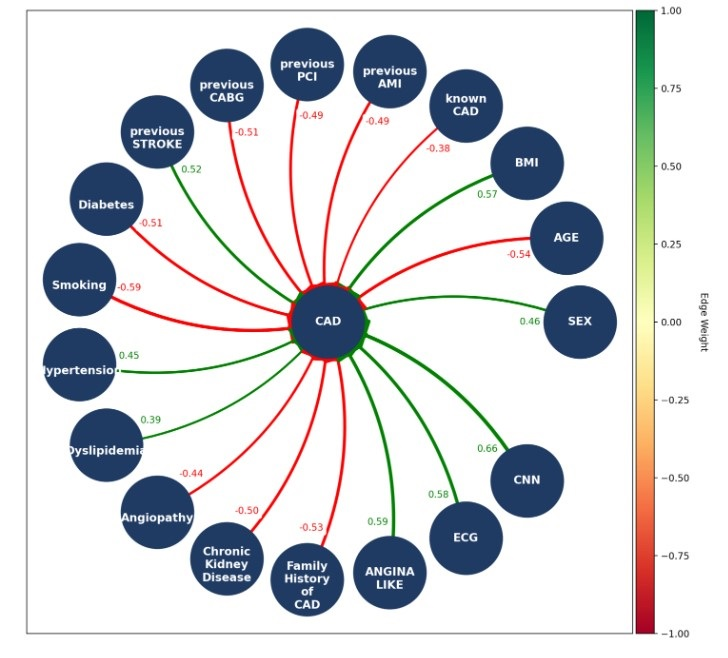
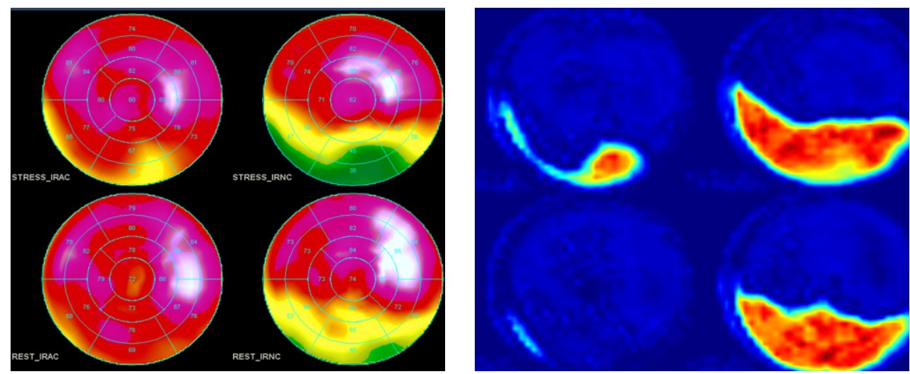

# DeepFCM-GA

# Usage

This multimodal approach enhances interpretability by integrating both clinical and imaging data, providing a transparent view of interconnections and their contributions to DeepFCM's predictive accuracy.

To use DeepFCM-GA, utilize the following code block:

```
best_fcm = DeepFCM_GA(pop_size, mutation_rate, num_dimensions, training_dataset, excel_file_path)
```

# Training

The training process of DeepFCM-GA is demonstrated.

```
def DeepFCM_GA(population_size,  mutation_rate, num_dimensions, training_dataset, excel_file_path):
    # Generate initial population
    population = generate_population_from_excel(population_size, num_dimensions, excel_file_path)
  
    # for generation in range(num_generations):
    fitness_scores = np.array([evaluate_fitness(fcm, training_dataset, num_dimensions) for fcm in population])
  
    # Selection
    parents = [selection(population, fitness_scores) for _ in range(population_size//2)]
  
    # Crossover
    children = [crossover(parent1, parent2) for parent1, parent2 in parents]
    children = [child for sublist in children for child in sublist]

    # Mutation
    mutated_children = [mutation(child, mutation_rate) for child in children]

    # Create new population
    population = mutated_children
  
    # Optionally, you can track the best FCM in each generation
    best_fcm = min(population, key=lambda fcm: evaluate_fitness(fcm, training_dataset, num_dimensions))
    # print(f"Generation {generation+1}: Best Fitness Score: {evaluate_fitness(best_fcm, dataset)}")
  
    return best_fcm
```

# Interpretation

This block of code will demonstrate the interconnections among concepts

```
plot_FCM_weight_matrix_graph(column_names, last_column_except_last)
```



Additionally, Grad-CAM provides interpretation of CNN predictions, highlighting critical regions that contribute to the model’s decision.


```
for filename in os.listdir(data_dir):
    if any(filename.lower().endswith(ext) for ext in image_extensions):
        file_path = os.path.join(data_dir, filename)
        image = cv2.imread(file_path)
        if image is None:
            print(f"File not found or unable to read: {file_path}")
            continue

        print("Processing:", file_path)
        if 'normal' in filename.lower():
            actual_class = 'normal'
        else:
            actual_class = 'class1'
        # Preprocess the image
        image_resized = cv2.resize(image, (pixel_size, pixel_size))
        image_resized = image_resized.astype('float32') / 255
        image_resized = np.expand_dims(image_resized, axis=0)

        # Predict the class
        preds = model.predict(image_resized)
        prediction = (preds > 0.5).astype(int)

        if prediction == 0:
            print("The model misclassified this instance as class1")
        else:
            print("The model predicted this instance as class2")
          
        if prediction == 0:
            predicted_class = 'class1'
            print("The model misclassified this instance as class1")
        else:
            predicted_class = 'class0'
            print("The model predicted this instance as class0")

        # Define the GradCAM instance with the manually set layer name
        icam = GradCAM(model, np.argmax(preds[0]), layerName=last_conv_layer_name)
        heatmap = icam.compute_heatmap(image_resized)
        heatmap_resized = cv2.resize(heatmap, (pixel_size, pixel_size))

        # Overlay the heatmap onto the original image
        (heatmap, output) = icam.overlay_heatmap(heatmap_resized, image, alpha=0.5)

        # Convert images to RGB for display
        # image_rgb = cv2.cvtColor(image, cv2.COLOR_BGR2RGB)
        heatmap_rgb = cv2.cvtColor(heatmap, cv2.COLOR_BGR2RGB)
      
      
        # Concatenate heatmap and original image side by side
        concatenated = np.concatenate((image, heatmap_rgb), axis=1)

        # Save the concatenated image
        output_filename = os.path.join(output_folder, f"gradcam_actual{actual_class}_pred_{predicted_class}_{os.path.splitext(filename)[0]}.png")
        cv2.imwrite(output_filename, concatenated)

        print(f"Saved concatenated image at: {output_filename}")
```

## Dataset Description:

•	dataset.xlsx: It includes the clinical data in an array format with rows the number of instances and columns. For every instance, the id is provided.
•	images: This folder contains the images, along with their ids.
•	suggested_weights: This Excel file is optional for DeepFCM-GA. It includes the linguistic values for the input-output interconnections among DeepFCM concepts provided by experts.

Algorithm file: main.py is the DeepFCM algorithm tha integrates GA into DeepFCM learning processes that
combines the tabular data and CNN predictions to classify the imaging case studies.

## Prerequisites:

-numpy
-time
-random
-pandas
-scikit-learn
-math
-statistics
-matplotlib
-networkx

## Supervisor

[Elpiniki Papageorgiou](https://emerald.uth.gr/personnel/)

## Contributors

[Anna Feleki](https://emerald.uth.gr/personnel/)
[Elpiniki Papageorgiou](https://emerald.uth.gr/personnel/)
[Ioannis Apostolopoulos](https://emerald.uth.gr/personnel/)
[Nikolaos Papandrianos](https://emerald.uth.gr/personnel/)
[Serafeim Moustakidis](https://emerald.uth.gr/personnel/)

## Assets

In the /assets folder, you'll find an example file for suggested_weights, a demonstration of Grad-CAM, and a visual representation of the interconnections among concepts in a DeepFCM graph.
For suggested weights file, the following linguistic values must be provided, each representing a specific range:

For positive influence among concepts:
Very Weak (VW): [0,0.25]
Weak (W): [0.1,0.4]
Medium (M): [0.35,0.65]
Strong (S): [0.55,0.85]
Very Strong (VS): [0.75,1]

For negative influence among concepts:
-Very Weak (-VW): [-0.25,0]
-Weak (-W): [-0.4,-0.1]
-Medium (-M): [-0.65,-0.35]
-Strong (-S): [-0.85,-0.55]
-Very Strong (-VS): [-1,0.75]

Otherwise please provide the value :
random: [-1,1]
