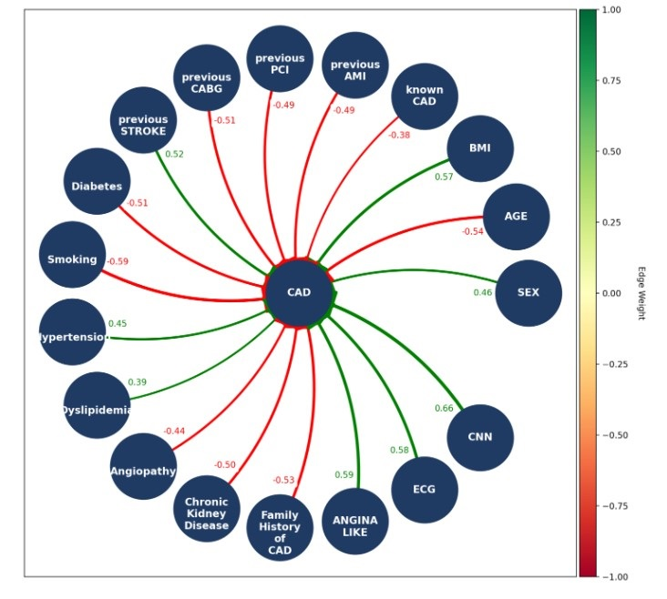

# DeepFCM-GA
This is the official implementation of
[https://www.thinkmind.org/library/EXPLAINABILITY/EXPLAINABILITY_2024/explainability_2024_1_60_10032.html](https://www.thinkmind.org/library/EXPLAINABILITY/EXPLAINABILITY_2024/explainability_2024_1_60_10032.html)

# Paper Abstract
Non-small cell lung cancer is a prevalent form of lung cancer, with Solitary Pulmonary Nodules (SPNs) as a key indicator. Early detection and accurate diagnosis are critical for effective treatment. While Convolutional Neural Networks (CNNs) have been successful in diagnosing SPNs from Computed Tomography (CT) and Positron Emission Tomography (PET) imaging, they lack explainability. To address this, we applied DeepFCM, a multimodal approach that combines Fuzzy Cognitive Maps (FCMs) with CNNs, integrating clinical and PET imaging data to predict SPN malignancy. Clinical data include patient characteristics (i.e., gender, age, Body Mass Index, Glucose Levels) and SPN characteristics (diameter, Standardized Uptake Value (SUV)max, location, type, and margins). Predictions from the RGB-CNN, trained on PET images, are used as additional inputs for DeepFCM. Initially defined by nuclear experts using fuzzy sets, concept interconnections were adapted with Particle Swarm Optimization (PSO) and Genetic Algorithm (GA). DeepFCM is integrated into a Medical Decision Support System (MDSS) to enable data-driven predictions for NSCLC. To improve explainability, Gradient-weighted Class Activation Mapping (Grad-CAM) highlights significant image regions, while DeepFCM illustrates the relationships between each feature to NSCLC diagnosis. Natural Language Generation (NLG) is applied to explain the DeepFCM decision-making process by demonstrating each feature's impact on the diagnosis in human-understandable language.

# Multimodal approach (Clinical + Imaging Data)

# Define class labels

class0_name='normal'

class1_name='pathological'

# To set the path of the imaging folder

Specify the input size (in pixels) for resizing all images:

pixel_size = 300

Ensure that your images have one of the following extensions

```
def read_and_process_image(list_of_images):
    X = []
    for img in list_of_images:
        image = cv2.imread(img)
        X.append(cv2.resize(image, (pixel_size, pixel_size), interpolation=cv2.INTER_CUBIC))

    # Define the output of each image to a different list
    y = [0 if class0_name in addr else 1 for addr in list_of_images]

    return X, y
```

# Model training configuration

Set the number of epochs, batch size, and architecture of RGB-CNN.

epochs = 200

batch_size = 32

# CNN Architecture (RGB-CNN)

model = Sequential([

    Conv2D(16, (3, 3), activation='relu', input_shape=(pixel_size, pixel_size, 3)),

    MaxPooling2D((2, 2)),

    Dropout(0.1),

    Conv2D(32, (3, 3), activation='relu'),

    MaxPooling2D((2, 2)),

    Dropout(0.1),

    Conv2D(64, (3, 3), activation='relu'),

    MaxPooling2D((2, 2)),

    Dropout(0.1),

    Conv2D(64, (3, 3), activation='relu'),

    MaxPooling2D((2, 2)),

    Dropout(0.1),

    Conv2D(128, (3, 3), activation='relu'),

    MaxPooling2D((2, 2)),

    Dropout(0.1),

    Flatten(),

    Dropout(0.1),

    Dense(128, activation='relu'),

    Dense(64, activation='relu'),

    Dense(1, activation='sigmoid')

])

# Clinical Data Normalization

Select which columns to be normalized with the Min-max normalization

columns_to_normalize = ['column1', 'column2']  # Add any other columns you need to normalize

# DeepFCM-GA hyperparameters

pop_size= 40

#define number of generations

num_generations = 150

#define crossover rate

crossover_rate = 0.8

#define mutation rate

mutation_rate = 0.08

#define number of iterations

num_iterations=40

num_folds=10

# Expert knowledge (if provided)

If expert knowledge is provided in the form of fuzzy sets, the user must define the Excel file.

excel_file_path = "suggested_weights.xlsx"

# Usage

This multimodal approach enhances interpretability by integrating both clinical and imaging data, providing a transparent view of interconnections and their contributions to DeepFCM's predictive accuracy.

To use DeepFCM-GA, utilize the following code block:

```
best_fcm = DeepFCM_GA(pop_size, mutation_rate, num_dimensions, training_dataset, excel_file_path)
```

# Training

The training process of DeepFCM-GA is demonstrated.

```
def DeepFCM_GA(population_size,  mutation_rate, num_dimensions, training_dataset, excel_file_path):
    # Generate initial population
    population = generate_population_from_excel(population_size, num_dimensions, excel_file_path)
  
    # for generation in range(num_generations):
    fitness_scores = np.array([evaluate_fitness(fcm, training_dataset, num_dimensions) for fcm in population])
  
    # Selection
    parents = [selection(population, fitness_scores) for _ in range(population_size//2)]
  
    # Crossover
    children = [crossover(parent1, parent2) for parent1, parent2 in parents]
    children = [child for sublist in children for child in sublist]

    # Mutation
    mutated_children = [mutation(child, mutation_rate) for child in children]

    # Create new population
    population = mutated_children
  
    # Optionally, you can track the best FCM in each generation
    best_fcm = min(population, key=lambda fcm: evaluate_fitness(fcm, training_dataset, num_dimensions))
    # print(f"Generation {generation+1}: Best Fitness Score: {evaluate_fitness(best_fcm, dataset)}")
  
    return best_fcm
```

# Interpretation

This block of code will demonstrate the interconnections among concepts

```
plot_FCM_weight_matrix_graph(column_names, last_column_except_last)
```



Additionally, Grad-CAM provides interpretation of CNN predictions, highlighting critical regions that contribute to the model’s decision.

```
for filename in os.listdir(data_dir):
    if any(filename.lower().endswith(ext) for ext in image_extensions):
        file_path = os.path.join(data_dir, filename)
        image = cv2.imread(file_path)
        if image is None:
            print(f"File not found or unable to read: {file_path}")
            continue

        print("Processing:", file_path)
        if 'normal' in filename.lower():
            actual_class = 'normal'
        else:
            actual_class = 'class1'
        # Preprocess the image
        image_resized = cv2.resize(image, (pixel_size, pixel_size))
        image_resized = image_resized.astype('float32') / 255
        image_resized = np.expand_dims(image_resized, axis=0)

        # Predict the class
        preds = model.predict(image_resized)
        prediction = (preds > 0.5).astype(int)

        if prediction == 0:
            print("The model misclassified this instance as class1")
        else:
            print("The model predicted this instance as class2")
      
        if prediction == 0:
            predicted_class = 'class1'
            print("The model misclassified this instance as class1")
        else:
            predicted_class = 'class0'
            print("The model predicted this instance as class0")

        # Define the GradCAM instance with the manually set layer name
        icam = GradCAM(model, np.argmax(preds[0]), layerName=last_conv_layer_name)
        heatmap = icam.compute_heatmap(image_resized)
        heatmap_resized = cv2.resize(heatmap, (pixel_size, pixel_size))

        # Overlay the heatmap onto the original image
        (heatmap, output) = icam.overlay_heatmap(heatmap_resized, image, alpha=0.5)

        # Convert images to RGB for display
        # image_rgb = cv2.cvtColor(image, cv2.COLOR_BGR2RGB)
        heatmap_rgb = cv2.cvtColor(heatmap, cv2.COLOR_BGR2RGB)
  
  
        # Concatenate heatmap and original image side by side
        concatenated = np.concatenate((image, heatmap_rgb), axis=1)

        # Save the concatenated image
        output_filename = os.path.join(output_folder, f"gradcam_actual{actual_class}_pred_{predicted_class}_{os.path.splitext(filename)[0]}.png")
        cv2.imwrite(output_filename, concatenated)

        print(f"Saved concatenated image at: {output_filename}")
```

## Dataset Description:

•	dataset.xlsx: It includes the clinical data in an array format with rows the number of instances and columns. For every instance, the id is provided.
•	images: This folder contains the images, along with their ids.
•	suggested_weights: This Excel file is optional for DeepFCM-GA. It includes the linguistic values for the input-output interconnections among DeepFCM concepts provided by experts.

Algorithm file: main.py is the DeepFCM algorithm tha integrates GA into DeepFCM learning processes that
combines the tabular data and CNN predictions to classify the imaging case studies.

## Prerequisites:

-numpy
-time
-random
-pandas
-scikit-learn
-math
-statistics
-matplotlib
-networkx

## Supervisor

[Elpiniki Papageorgiou](https://emerald.uth.gr/personnel/)

## Contributors

[Anna Feleki](https://emerald.uth.gr/personnel/)
[Elpiniki Papageorgiou](https://emerald.uth.gr/personnel/)
[Ioannis Apostolopoulos](https://emerald.uth.gr/personnel/)
[Nikolaos Papandrianos](https://emerald.uth.gr/personnel/)
[Serafeim Moustakidis](https://emerald.uth.gr/personnel/)

## Assets

In the /assets folder, you'll find an example file for suggested_weights, and a visual representation of the interconnections among concepts in a DeepFCM graph.
For suggested weights file, the following linguistic values must be provided, each representing a specific range:

For positive influence among concepts:
Very Weak (VW): [0,0.25]
Weak (W): [0.1,0.4]
Medium (M): [0.35,0.65]
Strong (S): [0.55,0.85]
Very Strong (VS): [0.75,1]

For negative influence among concepts:
-Very Weak (-VW): [-0.25,0]
-Weak (-W): [-0.4,-0.1]
-Medium (-M): [-0.65,-0.35]
-Strong (-S): [-0.85,-0.55]
-Very Strong (-VS): [-1,0.75]

Otherwise please provide the value :
random: [-1,1]
